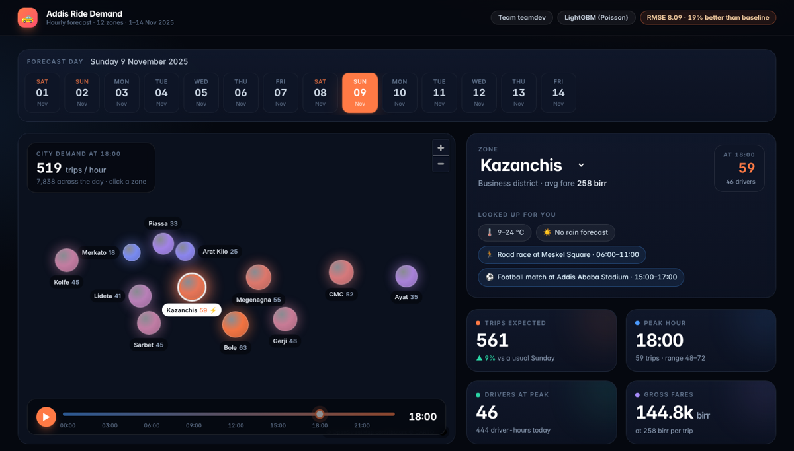

<div align="center">

# 🚕 Addis Ababa Ride Demand Forecasting

**Hourly trip forecasts for 12 Addis Ababa zones, 1–14 November 2025**

Team **teamdev** · Qiyas AI Hackathon #2 · IADE AI Training Program, Addis Ababa University


-0D7D81)


</div>

---

## Overview

Ride demand in Addis Ababa swings by zone, hour, weather and events, and operators must place drivers
before it arrives. We turned three messy exports (ten months of hourly trips, hourly weather and an
events calendar) into one clean zone-hour table, fixing 28 documented data problems on the way. The
biggest one was a weather clock stored in UTC rather than Addis time, which hid the rain effect until
we corrected it. A tuned **LightGBM** model trained only on forecast-time features predicts the
**4,032 zone-hours** of 1–14 November. It reaches a validation **RMSE of 8.09**, 19% better than the
best simple baseline, which is about four drivers off per zone-hour. Every forecast also comes with a
calibrated 80% and 90% range, and a local web app turns the forecasts into a driver plan.

| Metric | Score |
|---|---|
| Validation RMSE / MAE (18–31 Oct 2025, held out) | **8.09** / **5.60** trips per zone-hour |
| Rolling-origin RMSE (5 × 14-day folds) | **8.68 ± 0.80** |
| Best baseline (seasonal naive, last 4 weeks) | 9.94 |
| 80% / 90% interval coverage | 79.8% / 89.6% |

---

## Team

| Name | Student ID |
|---|---|
| Abraham Gebeyehu | qiyas-2026-004484 |
| Bethelhem Legesse | qiyas-2026-000286 |
| Eden Kibret | qiyas-2026-000721 |
| Eleni Andualem | qiyas-2026-000054 |
| Feven Abebe | qiyas-2026-003641 |
| Surafel Solomon | qiyas-2026-007128 |

---

## Quick start

Requires **Python 3.10+** (developed on 3.13). All versions are pinned in [`requirements.txt`](requirements.txt).

```bash
git clone https://github.com/EleniAndualem/hackathon.git
cd hackathon
python -m venv .venv && source .venv/bin/activate     # Windows: .venv\Scripts\activate
pip install -r requirements.txt

python app/app.py                                     # demo → http://localhost:8000
```

---

## Demo

<p align="center"></p>

**Run it locally with one command:** `python app/app.py`, then open <http://localhost:8000>. There is no
hosted URL; the demo runs live from a laptop.

- **Input:** a zone and a date between 1 and 14 November 2025. Weather and events are looked up
  automatically from `app/assets/`.
- **Output:**
  - a 24-hour forecast curve with its 80% range, the zone's usual day, and shaded event windows;
  - the peak hour;
  - drivers needed (trips ÷ 1.3 per driver-hour) and gross fares;
  - an hourly table you can export as CSV.
- **City view:** a live map of all 12 zones, an hour slider, and a ranking of the zones for the day.
- **Out-of-range dates** get a friendly message instead of an error.
- **Layout:** a left sidebar (collapsible) with Overview, Forecast, Driver Plan and Data Table links,
  a zone picker, all zones at the selected hour and the model card.
- **About page** (`/about`, or the **TD** avatar): the business problem, data, pipeline, key findings,
  model comparison, limitations and team on one page.
- **Deep link:** `http://localhost:8000/?zone=Kazanchis&date=2025-11-09` opens that zone and day.

The app is a FastAPI service (`app/app.py`) that serves the model through a JSON API and a Next.js
interface.

| Route | Returns |
|---|---|
| `GET /api/health` | Status, rows scored, whether a CARTO key is set |
| `GET /api/meta` | Model scores, zones with coordinates, dates, basemap styles |
| `GET /api/forecast?zone=&date=` | 24-hour forecast with ranges, drivers, fares, weather and events |
| `GET /api/city?date=` | All 12 zones for one day, ranked |
| `GET /api/basemap/{dark\|light\|voyager}/{z}/{x}/{y}.png` | CARTO map tiles, fetched and cached by the server |

**Map:** CARTO basemaps (Dark, Light, Streets). CARTO's basemap tiles are public and need no key. The
server fetches and caches them; an optional `CARTO_API_KEY` (in `app/.env` locally, or Vercel's environment
variables) is sent along but never reaches the browser or the repo. If the server cannot reach CARTO, the
browser loads the public tiles directly. With no internet at all, the map shows a plain background and
still shows every zone.

The interface's compiled build is committed in `app/web/out/`, so you need **Python only**.
To change the interface, run `npm install && npm run build` in `app/web/`. A simpler Streamlit fallback
is in `app/streamlit_app.py`.

### Deploy the dashboard to Vercel

The web app in `app/web/` deploys to Vercel as a standard Next.js project. On Vercel, its own route
handlers answer the same `/api/...` routes from `app/web/data/*.json`. These files are the FastAPI app's
responses for every zone and day, pre-computed by `python app/export_static_api.py`. The Python model
libraries (about 285 MB) exceed Vercel's 250 MB function limit, so the model runs at build time instead
of on each request. The forecast inputs for 1–14 November are fixed, so the answers are identical.

1. On Vercel, choose **Add New → Project** and import `EleniAndualem/hackathon`.
2. Set **Root Directory** to `app/web`. The framework (Next.js) is detected automatically, and
   `app/web/vercel.json` sets the install and build commands.
3. Under **Environment Variables**, add these (see `app/web/.env.example`):

   | Name | Value | Needed? |
   |---|---|---|
   | `CARTO_API_KEY` | your CARTO key | Optional: used only by the server-side `/api/basemap` tile route |
   | `NEXT_PUBLIC_API_BASE` | URL of a hosted FastAPI server | Leave empty to use the built-in `/api` routes |

4. Click **Deploy**, then check `https://<your-app>.vercel.app/api/health`.

After retraining the model, run `python -m src.app_assets && python app/export_static_api.py` and commit
`app/web/data/` so Vercel serves the new forecasts.

---

## Reproduce the results

Run the notebooks **in order**; each one writes what the next one reads. Then run the three scripts.

| # | Step | Produces | Time |
|---|---|---|---|
| 1 | [`01_cleaning_and_integration.ipynb`](notebooks/01_cleaning_and_integration.ipynb) | **A**: cleaning log, timezone proof, joins, integrity checks, master tables | 2 min |
| 2 | [`02_analysis_report.ipynb`](notebooks/02_analysis_report.ipynb) | **B**: the 14 analysis tasks and a feature correlation matrix | 2 min |
| 3 | [`03_visualizations.ipynb`](notebooks/03_visualizations.ipynb) | **C**: figures 1–9 and captions | 1 min |
| 4 | [`04_modeling_and_evaluation.ipynb`](notebooks/04_modeling_and_evaluation.ipynb) | **D**: baselines, models, validation, ablation, tuning, error analysis, figures 10–12, final model | 20 min |
| 5 | `python -m src.predict` | Submission file, prediction intervals | < 1 min |
| 6 | `python -m src.app_assets` | Lookup tables for the demo | < 1 min |
| 7 | `python app/export_static_api.py` | Pre-computed API responses for the Vercel deployment | < 1 min |

```bash
cd notebooks
for nb in 01_cleaning_and_integration 02_analysis_report 03_visualizations 04_modeling_and_evaluation; do
  jupyter nbconvert --to notebook --execute --inplace "$nb.ipynb"
done
cd .. && python -m src.predict && python -m src.app_assets && python app/export_static_api.py
```

Every number, table and figure is produced by this code. Paths are relative and `random_state = 42`.

---

## Results

| Model | RMSE | MAE | Rolling RMSE |
|---|---:|---:|---:|
| Mean predictor *(baseline)* | 27.53 | 20.69 | — |
| Moving average, 7 days *(baseline)* | 14.55 | 9.49 | 15.09 |
| Seasonal naive, 4 weeks *(baseline)* | 9.94 | 6.64 | 11.48 |
| Ridge regression | 12.99 | 7.80 | 13.95 |
| ARIMA, per zone | 10.41 | 6.86 | 11.52 |
| Random forest | 8.79 | 5.97 | 9.60 |
| Gradient boosting (scikit-learn) | 8.63 | 5.92 | 9.16 |
| HistGradientBoosting | 8.20 | 5.65 | 8.99 |
| **LightGBM, tuned + holiday-eve feature (final)** | **8.09** | **5.60** | **8.68** |

RMSE and MAE are on 18–31 Oct; rolling RMSE is the mean over 5 folds. The test file is never scored.

**Key findings**

- 🕒 **Weather was on UTC.** Shifting it +3 h to Addis time raised the rain–demand correlation from
  0.02 to 0.27.
- 🌧️ **Rain raises demand** by up to 64% in heavy rain, except at the open-air Merkato market, where
  demand falls 42%.
- ⚽ **Football matches** lift demand 1.8× before kick-off and 2.3× in the two hours after.
- 📈 **Demand grew about 40%** from January to October, so recent-level features matter.
- 🧩 **Weather and events pay off.** Together they cut rolling RMSE by 11.7% (weather −8.9%, events −3.5%).
- ⚠️ **Holiday eves cause the biggest misses.** 9 of the 10 largest errors fall on them, which
  motivated the holiday-eve feature.

---

## Deliverables

| | Deliverable | Where |
|---|---|---|
| 🎯 | Prediction file (4,032 rows, original order) | [`submission/team_teamdev_submission.csv`](submission/team_teamdev_submission.csv) |
| **A** | Cleaning & integration (A1–A8) | [`reports/A_cleaning_and_integration.md`](reports/A_cleaning_and_integration.md) · [`data/processed/`](data/processed) |
| **B** | Data analysis (B1.1–B4.3) | [`reports/B_analysis_report.md`](reports/B_analysis_report.md) |
| **C** | Visualisation pack (12 figures + captions) | [`figures/`](figures) · [`figure_captions.md`](figures/figure_captions.md) |
| **D** | Modelling & evaluation (D1–D9) | [`reports/D_model_evaluation.md`](reports/D_model_evaluation.md) · [`models/`](models) |
| **E** | Demo app | [`app/`](app) |
| **F** | Presentation | [`presentation/team_teamdev_slides.pptx`](presentation/team_teamdev_slides.pptx) |
| **G** | Structure & reproducibility | this README · [`requirements.txt`](requirements.txt) |
| ✨ | Stretch: prediction intervals | [`reports/D_stretch_uncertainty.md`](reports/D_stretch_uncertainty.md) · [`submission/team_teamdev_prediction_intervals.csv`](submission/team_teamdev_prediction_intervals.csv) |

<details>
<summary><b>Repository structure</b></summary>

```
hackathon/
├── README.md · requirements.txt
├── submission/      team_teamdev_submission.csv, team_teamdev_prediction_intervals.csv
├── data/
│   ├── raw/         original CSVs (never edited)
│   └── processed/   master_train.csv, master_test.csv, data_dictionary_master.csv, cleaned tables
├── notebooks/       01_… → 04_… (run in order)
├── src/             cleaning.py, features.py, train.py, predict.py, app_assets.py, helpers
├── models/          final_model.joblib, final_model_params.json
├── figures/         fig01_… → fig12_…, figure_captions.md
├── reports/         A_…, B_…, D_… reports, cleaning log, extra charts
├── app/             app.py (FastAPI), streamlit_app.py, requirements.txt, assets/, web/ (Next.js)
├── presentation/    team_teamdev_slides.pptx
└── docs/            hackathon instructions, demo screenshot
```
</details>

<details>
<summary><b>Methodology</b></summary>

- **Cleaning:**
  - zone names and event types are mapped to one spelling;
  - every date format is parsed explicitly;
  - sentinel values (`-9999`, `-1`), a Fahrenheit block, ×8 export spikes and duplicate hours are fixed;
  - each fix is logged with its row count and reason.
- **Integration:**
  - the zone × hour grid is the left table, so row counts never change;
  - weather joins on the EAT hour;
  - venue events open 2 h before they start and close 3 h after they end.
- **Features (36, all known in advance):**
  - calendar (hour, weekday, holidays, holiday eve, payday, trend);
  - zone and zone type;
  - weather (temperature, rain, rain over the last 3 h, humidity, wind);
  - events (type, phase, attendance);
  - history (lags of 14 days or more, a recent zone × weekday × hour profile).
- **Modelling:**
  - LightGBM with a Poisson objective, since demand is a count;
  - tuned by random search on the earlier rolling folds only, so the main validation fortnight never
    influenced tuning;
  - intervals from split-conformal residuals.
</details>

<details>
<summary><b>Compliance with the hackathon rules</b></summary>

| Rule | How it is met |
|---|---|
| Weather and event features in the final model | 6 weather and 12 event features; the ablation measures what each adds |
| Forecast-time features only | Fares, wait times and active drivers are excluded; every lag is ≥ 14 days; leakage audit in D4 |
| Chronological validation | A held-out fortnight plus 5 rolling-origin folds |
| Nothing fitted on the test file | Encoders, profiles and caps are fitted on training rows only, and re-fitted inside each fold |
| Reproducibility | Pinned versions, relative paths, `random_state = 42`, notebooks run top to bottom |
| Raw data untouched | `data/raw/` is read-only; outputs go to `data/processed/` |
</details>

---

<sub>All data is synthetic and was provided by the hackathon organisers for training purposes.</sub>
