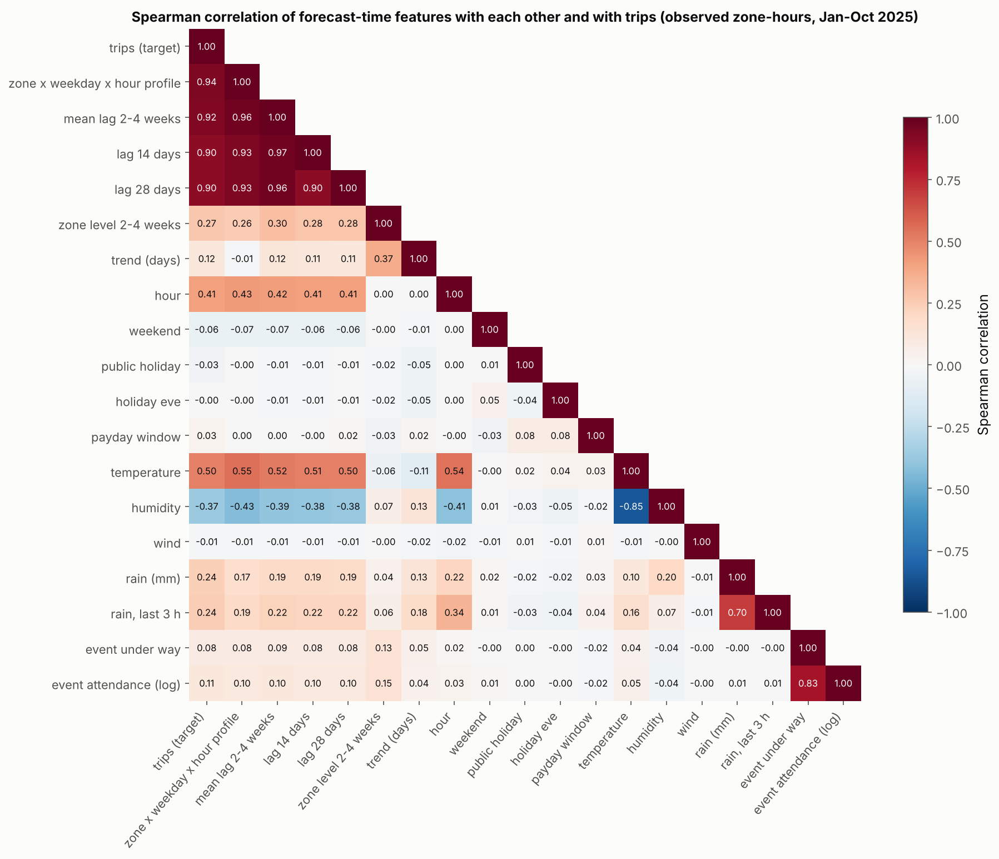

# B — Data Analysis Report (team teamdev)

Generated by `notebooks/02_analysis_report.ipynb` from `data/processed/master_train.csv`. Only observed zone-hours are used (outage, pre-launch and missing hours excluded). **Demand ratio** = trips / expected trips for the same zone, weekday and hour in the same week, fitted on ordinary hours (no event, holiday or rain) — see `src/analysis.py`.

## B1 Demand patterns

### B1.1 Volume by zone

| zone      | zone_type         |   total_trips |   share_pct |   zone_hours |   mean_per_zone_hour |   mean_since_15_mar |   rank_by_mean_since_15_mar | first_hour          |
|:----------|:------------------|--------------:|------------:|-------------:|---------------------:|--------------------:|----------------------------:|:--------------------|
| Merkato   | market            |      285655.0 |        12.1 |         7050 |                 40.5 |                42.0 |                           1 | 2025-01-01 00:00:00 |
| Bole      | nightlife_airport |      277500.5 |        11.7 |         7075 |                 39.2 |                41.3 |                           2 | 2025-01-01 00:00:00 |
| Megenagna | transport_hub     |      270082.5 |        11.4 |         7063 |                 38.2 |                40.1 |                           3 | 2025-01-01 00:00:00 |
| Kazanchis | business_district |      224383.5 |         9.5 |         7069 |                 31.7 |                33.2 |                           4 | 2025-01-01 00:00:00 |
| Piassa    | business_district |      199787.0 |         8.5 |         7074 |                 28.2 |                29.6 |                           5 | 2025-01-01 00:00:00 |
| Lideta    | transport_hub     |      198216.0 |         8.4 |         7076 |                 28.0 |                29.4 |                           6 | 2025-01-01 00:00:00 |
| CMC       | residential       |      182395.0 |         7.7 |         7087 |                 25.7 |                27.0 |                           7 | 2025-01-01 00:00:00 |
| Gerji     | residential       |      170607.0 |         7.2 |         7052 |                 24.2 |                25.4 |                           8 | 2025-01-01 00:00:00 |
| Kolfe     | residential       |      162352.5 |         6.9 |         7073 |                 23.0 |                24.1 |                           9 | 2025-01-01 00:00:00 |
| Sarbet    | residential       |      153004.5 |         6.5 |         7062 |                 21.7 |                22.7 |                          10 | 2025-01-01 00:00:00 |
| Arat Kilo | business_district |      144575.5 |         6.1 |         7067 |                 20.5 |                21.4 |                          11 | 2025-01-01 00:00:00 |
| Ayat      | residential       |       95485.6 |         4.0 |         5356 |                 17.8 |                17.8 |                          12 | 2025-03-15 00:00:00 |

**Merkato, Bole and Megenagna** carry the most demand (35.2% of all trips between them, 38–41 trips per zone-hour vs a city mean of 28.4). Ayat only operated from 15 Mar so its total (4.0% share) understates it; comparing on the common period since 15 Mar, Ayat averages 17.8 trips/zone-hour (rank 12 of 12).

### B1.2 Hour-of-day profile by zone type (weekdays)

Zones were grouped by the shape of their weekday profile (each zone's hourly mean / its daily mean) plus the weekend ratio, with rules fitted on training data (`features.fit_zone_types`). Peaks are shown as multiples of the group's average hour.

| zone_type         | zones                           | morning_peak   | evening_peak   |   overall_peak_hour |   quietest_hour |   night_share_0to5_pct |
|:------------------|:--------------------------------|:---------------|:---------------|--------------------:|----------------:|-----------------------:|
| business_district | Arat Kilo, Kazanchis, Piassa    | 8:00 (2.0x)    | 18:00 (2.6x)   |                  18 |               2 |                    3.6 |
| market            | Merkato                         | 11:00 (2.0x)   | 13:00 (2.1x)   |                  13 |               0 |                    4.2 |
| nightlife_airport | Bole                            | 6:00 (1.6x)    | 20:00 (1.5x)   |                   6 |               2 |                   15.2 |
| residential       | Ayat, CMC, Gerji, Kolfe, Sarbet | 7:00 (2.1x)    | 19:00 (2.0x)   |                   7 |               2 |                    7.6 |
| transport_hub     | Lideta, Megenagna               | 8:00 (1.9x)    | 18:00 (2.2x)   |                  18 |               1 |                    6.2 |

Business districts have a sharp commute double peak (8:00 (2.0x) and 18:00 (2.6x)) and are nearly empty at night; residential zones peak earlier in the morning (7:00 (2.1x)) as people leave home and again in the evening (19:00 (2.0x)). Merkato (market) is a midday plateau that dies after 18:00, and Bole (nightlife/airport) is the only zone with real late-night demand (15% of its trips between 00:00 and 05:59). Every group is quietest around 02:00–04:00.

### B1.3 Weekday vs weekend

| zone      |   weekday_mean |   weekend_mean |   weekend_to_weekday | zone_type         |
|:----------|---------------:|---------------:|---------------------:|:------------------|
| Bole      |          35.90 |          47.55 |                 1.32 | nightlife_airport |
| Gerji     |          23.64 |          25.59 |                 1.08 | residential       |
| Sarbet    |          21.18 |          22.90 |                 1.08 | residential       |
| CMC       |          25.19 |          27.11 |                 1.08 | residential       |
| Kolfe     |          22.50 |          24.10 |                 1.07 | residential       |
| Ayat      |          17.56 |          18.48 |                 1.05 | residential       |
| Merkato   |          41.94 |          36.93 |                 0.88 | market            |
| Lideta    |          29.52 |          24.22 |                 0.82 | transport_hub     |
| Megenagna |          40.38 |          32.86 |                 0.81 | transport_hub     |
| Kazanchis |          37.03 |          18.46 |                 0.50 | business_district |
| Piassa    |          33.08 |          16.05 |                 0.49 | business_district |
| Arat Kilo |          23.98 |          11.57 |                 0.48 | business_district |

Day-of-week shape (mean trips per zone-hour) for the two extremes:

| day   |   Bole |   Kazanchis |   Bole_index |   Kazanchis_index |
|:------|-------:|------------:|-------------:|------------------:|
| Mon   |  34.66 |       36.81 |         0.88 |              1.16 |
| Tue   |  34.38 |       36.63 |         0.88 |              1.15 |
| Wed   |  34.08 |       37.24 |         0.87 |              1.17 |
| Thu   |  35.20 |       35.78 |         0.90 |              1.13 |
| Fri   |  41.12 |       38.64 |         1.05 |              1.22 |
| Sat   |  49.72 |       18.66 |         1.27 |              0.59 |
| Sun   |  45.38 |       18.27 |         1.16 |              0.58 |

Zones busier at the weekend: Bole, Gerji, Sarbet, CMC, Kolfe, Ayat — Bole most of all (1.32x), with Saturday its busiest day (1.27x its average day). Weekend demand collapses to about half in the business districts Kazanchis, Piassa, Arat Kilo (0.48–0.50x), so a model needs zone x weekday interactions, not a single weekend flag.

### B1.4 Trend

Weekly city-wide trips (full weeks only; Ayat excluded for a like-for-like series because it launched mid-March). A straight line through the 41 full weeks gives **+504 trips per week, every week**. The first 4 full weeks averaged 43,274 trips/week and the last 4 60,417: **40% growth** (mean trips per zone-hour 24.1 in January vs 34.0 in October, +41%).

| week_start          |   city_trips_all_zones |   city_trips_excl_ayat |
|:--------------------|-----------------------:|-----------------------:|
| 2025-01-06 00:00:00 |                 40,996 |                 40,996 |
| 2025-01-13 00:00:00 |                 42,990 |                 42,990 |
| 2025-01-20 00:00:00 |                 42,900 |                 42,900 |
| 2025-01-27 00:00:00 |                 46,210 |                 46,210 |
| 2025-09-29 00:00:00 |                 66,206 |                 62,736 |
| 2025-10-06 00:00:00 |                 62,674 |                 59,243 |
| 2025-10-13 00:00:00 |                 62,526 |                 59,248 |
| 2025-10-20 00:00:00 |                 63,914 |                 60,442 |

Implication: November should run above October — the trend line projects about 63,829 trips/week for the 11 older zones in early November vs 60,417 in the last 4 weeks. A model trained on the whole year without a level/trend feature would under-forecast, and a tree model cannot extrapolate a trend by itself, so we give it recent-level features (`lag_14d`, `zone_level_2to4w`) that already contain the growth.

## B2 Weather

### B2.1 Time-zone check

Two independent pieces of evidence. (1) **Temperature:** on the raw clock the average temperature peaks at 12:00 — a solar-noon peak that is too early for the afternoon maximum; after +3 h it peaks at 15:00 EAT. The raw file also starts at 30 Dec 21:00 and the forecast rows at 31 Oct 21:00, which are exactly midnight EAT on 31 Dec and 1 Nov. (2) **Rain–demand alignment:** we shift the raw weather clock by 0–6 h and correlate rain with the demand ratio (non-market zones, 06:00–22:00).

|   hours added to raw weather clock |   misalignment vs. correct (h) |   corr(rain_mm, demand ratio) |   demand ratio, rainy hours |   demand ratio, dry hours |   rain uplift % |
|-----------------------------------:|-------------------------------:|------------------------------:|----------------------------:|--------------------------:|----------------:|
|                                  0 |                             -3 |                         0.019 |                       1.039 |                     0.997 |           4.196 |
|                                  1 |                             -2 |                         0.030 |                       1.044 |                     0.997 |           4.706 |
|                                  2 |                             -1 |                         0.035 |                       1.050 |                     0.996 |           5.384 |
|                                  3 |                              0 |                         0.271 |                       1.181 |                     0.979 |          20.557 |
|                                  4 |                              1 |                         0.036 |                       1.050 |                     0.996 |           5.379 |
|                                  5 |                              2 |                         0.040 |                       1.046 |                     0.997 |           4.860 |
|                                  6 |                              3 |                         0.029 |                       1.044 |                     0.998 |           4.619 |

The rain signal is strongest at +3 h (UTC -> EAT): correlation 0.271 and rainy hours 21% above dry ones. Joining on the raw clock (0 h, i.e. trusting the timestamps as local) cuts the correlation to 0.019 and the uplift to 4%: a 3-hour clock error would hide most of the weather signal.

### B2.2 Rain effect by zone type

Each rainy zone-hour (rain_mm > 0, no event/holiday) is compared with the mean of dry hours of the same zone, weekday and hour in the same month (a matched comparison that also removes the trend). `rain_vs_dry_ratio` is the mean of the per-hour ratios, with a bootstrap 95% CI.

| zone_type         |   rainy_hours |   rainy_mean_trips |   matched_dry_mean_trips |   rain_vs_dry_ratio |   ci95_low |   ci95_high |
|:------------------|--------------:|-------------------:|-------------------------:|--------------------:|-----------:|------------:|
| residential       |          2524 |              37.76 |                    29.92 |                1.30 |       1.29 |        1.32 |
| nightlife_airport |           422 |              52.20 |                    41.56 |                1.29 |       1.25 |        1.33 |
| business_district |          1467 |              52.84 |                    41.86 |                1.29 |       1.27 |        1.31 |
| transport_hub     |          1030 |              59.92 |                    47.95 |                1.28 |       1.25 |        1.30 |
| market            |           516 |              44.77 |                    56.56 |                0.80 |       0.78 |        0.83 |

Rain raises demand in residential, nightlife_airport, business_district, transport_hub (about +28% to +30%), but **not everywhere**: in the market zone (Merkato) demand falls 20% because shoppers stay away from an open-air market. A single rain coefficient would be wrong; the model needs rain x zone-type interactions (a tree model learns them).

### B2.3 Rain dose-response

Rain classes: none (0 mm), light (0–2.5 mm/h), moderate (2.5–7.5), heavy (> 7.5). Cells are mean demand ratios vs the matched dry hours from B2.2 (so 'none' is ~1 by construction). Zone-hours per class: none 71,507, light 3,444, moderate 1,918, heavy 597.

| zone_type         |   none |   light |   moderate |   heavy |
|:------------------|-------:|--------:|-----------:|--------:|
| business_district |   1.00 |    1.18 |       1.38 |    1.59 |
| market            |   1.00 |    0.88 |       0.73 |    0.58 |
| nightlife_airport |   1.00 |    1.18 |       1.37 |    1.66 |
| residential       |   1.00 |    1.18 |       1.39 |    1.70 |
| transport_hub     |   1.00 |    1.17 |       1.37 |    1.57 |

Uplift per millimetre of rain (all zone types except the market):

| rain_class   |   mean_rain_mm |   mean_ratio |   uplift_pct |   uplift_pct_per_mm |
|:-------------|---------------:|-------------:|-------------:|--------------------:|
| none         |           0.00 |         1.00 |         0.00 |              nan    |
| light        |           1.13 |         1.18 |        17.90 |               15.83 |
| moderate     |           4.26 |         1.38 |        38.15 |                8.95 |
| heavy        |          11.20 |         1.64 |        64.42 |                5.75 |

Outside the market the response grows with intensity — light rain about +18%, moderate +38%, heavy +64% — but **less than proportionally**: each mm of rain adds about 16% in light rain, 9% in moderate and only 6% in heavy rain, so the effect saturates above roughly 5 mm/h. Merkato falls further the harder it rains (0.58x normal in heavy rain).

## B3 Events & calendar

### B3.1 Public holidays

City-wide trips per zone-hour on each holiday vs the same weekday 1 and 2 weeks before and after (skipping other holidays). Index 0.80 = 20% below normal. Ranked from biggest drop.

| holiday                            | date       | weekday   |   trips_per_zone_hour |   same_weekday_nearby_weeks |   index_vs_normal |   reference_days |   rank |
|:-----------------------------------|:-----------|:----------|----------------------:|----------------------------:|------------------:|-----------------:|-------:|
| Good Friday                        | 2025-04-18 | Fri       |                 21.61 |                       29.18 |              0.74 |                4 |      1 |
| Genna (Ethiopian Christmas)        | 2025-01-07 | Tue       |                 18.84 |                       24.63 |              0.76 |                2 |      2 |
| Eid al-Adha                        | 2025-06-06 | Fri       |                 24.23 |                       30.98 |              0.78 |                4 |      3 |
| Mawlid                             | 2025-09-04 | Thu       |                 26.78 |                       32.40 |              0.83 |                3 |      4 |
| Enkutatash (Ethiopian New Year)    | 2025-09-11 | Thu       |                 27.99 |                       33.37 |              0.84 |                3 |      5 |
| Eid al-Fitr                        | 2025-03-31 | Mon       |                 22.25 |                       26.41 |              0.84 |                4 |      6 |
| Downfall of the Derg               | 2025-05-28 | Wed       |                 24.20 |                       28.69 |              0.84 |                4 |      7 |
| International Labour Day           | 2025-05-01 | Thu       |                 23.95 |                       26.82 |              0.89 |                4 |      8 |
| Meskel (Finding of the True Cross) | 2025-09-27 | Sat       |                 29.78 |                       31.19 |              0.95 |                4 |      9 |
| Patriots' Victory Day              | 2025-05-05 | Mon       |                 22.05 |                       22.41 |              0.98 |                4 |     10 |
| Fasika (Ethiopian Easter)          | 2025-04-20 | Sun       |                 21.87 |                       22.16 |              0.99 |                4 |     11 |
| Timkat (Epiphany)                  | 2025-01-19 | Sun       |                 20.59 |                       20.24 |              1.02 |                4 |     12 |
| Adwa Victory Day                   | 2025-03-02 | Sun       |                 22.24 |                       20.14 |              1.10 |                4 |     13 |

Zone index (zone's holiday demand vs its own normal same-weekday demand):

| holiday                            |   Arat Kilo |   Ayat |   Bole |   CMC |   Gerji |   Kazanchis |   Kolfe |   Lideta |   Megenagna |   Merkato |   Piassa |   Sarbet |
|:-----------------------------------|------------:|-------:|-------:|------:|--------:|------------:|--------:|---------:|------------:|----------:|---------:|---------:|
| Adwa Victory Day                   |        1.06 | nan    |   1.04 |  1.04 |    1.05 |        1.31 |    1.05 |     0.99 |        1.10 |      1.10 |     1.38 |     1.01 |
| Downfall of the Derg               |        0.56 |   1.14 |   1.24 |  1.17 |    1.14 |        0.46 |    1.09 |     0.85 |        0.82 |      0.63 |     0.45 |     1.02 |
| Eid al-Adha                        |        0.49 |   1.07 |   1.11 |  1.03 |    1.07 |        0.60 |    1.08 |     0.73 |        0.70 |      0.47 |     0.43 |     1.04 |
| Eid al-Fitr                        |        0.52 |   1.18 |   1.35 |  1.07 |    1.12 |        0.50 |    1.08 |     0.80 |        0.87 |      0.60 |     0.48 |     1.15 |
| Enkutatash (Ethiopian New Year)    |        0.53 |   1.11 |   1.50 |  0.98 |    1.08 |        0.50 |    1.10 |     0.78 |        0.90 |      0.45 |     0.45 |     1.13 |
| Fasika (Ethiopian Easter)          |        0.90 |   0.96 |   1.12 |  0.85 |    0.93 |        0.97 |    1.00 |     1.00 |        1.02 |      0.99 |     0.96 |     0.94 |
| Genna (Ethiopian Christmas)        |        0.42 | nan    |   1.33 |  1.09 |    0.94 |        0.46 |    1.12 |     0.74 |        0.76 |      0.52 |     0.41 |     1.02 |
| Good Friday                        |        0.43 |   1.08 |   1.04 |  0.95 |    0.95 |        0.43 |    0.99 |     0.77 |        0.79 |      0.50 |     0.45 |     0.93 |
| International Labour Day           |        0.54 |   1.17 |   1.49 |  1.11 |    1.15 |        0.49 |    0.99 |     0.86 |        0.92 |      0.52 |     0.56 |     1.31 |
| Mawlid                             |        0.36 |   1.09 |   1.32 |  1.10 |    1.13 |        0.50 |    1.18 |     0.78 |        0.91 |      0.51 |     0.50 |     0.88 |
| Meskel (Finding of the True Cross) |        0.98 |   1.00 |   0.97 |  1.01 |    0.97 |        1.44 |    1.00 |     1.07 |        0.93 |      0.48 |     1.18 |     1.10 |
| Patriots' Victory Day              |        0.60 |   1.44 |   1.45 |  1.26 |    1.36 |        0.60 |    1.22 |     1.03 |        0.99 |      0.58 |     0.51 |     1.28 |
| Timkat (Epiphany)                  |        1.25 | nan    |   1.00 |  0.97 |    0.96 |        0.90 |    1.01 |     1.02 |        1.12 |      0.96 |     1.25 |     0.98 |

Not all holidays reduce demand: 8 of 13 lower it by more than 5% (deepest: Good Friday, 26% below normal) while 1 raises it (Adwa Victory Day +10%). Reactions are local: the zone furthest below its holiday's city index is Merkato on Meskel (Finding of the True Cross) (-0.48), and the furthest above is Ayat on Timkat (Epiphany) (+nan) — business districts empty out on holidays while Bole and the residential zones hold up.

### B3.2 Event-window study (football)

41 confirmed matches before 1 Nov, all at Addis Ababa Stadium (Kazanchis). The comparison is the expected demand for the same zone, weekday and hour in the same week without any event.

| window            |   zone_hours |   mean_trips |   same_zone_hours_without_event |   uplift_pct | ci95_pct     |
|:------------------|-------------:|-------------:|--------------------------------:|-------------:|:-------------|
| 2 h before start  |           73 |         74.9 |                            41.2 |         81.6 | +60 to +92   |
| during the match  |           78 |         48.6 |                            34.8 |         39.7 | +22 to +53   |
| 2 h after the end |           77 |         64.3 |                            28.3 |        126.9 | +104 to +160 |

Every window is above normal, and **the 2 hours after the final whistle show the largest uplift (+127%)** — the whole crowd leaves at once — ahead of the arrival window (+82%). During the match the uplift is smaller (+40%) because spectators are inside the stadium.

### B3.3 Event-type ranking

Effect = mean demand ratio in the affected zone(s) during the event window, minus 1 (bootstrap 95% CI). The expected demand comes from ordinary hours, so the school-break row compares break weeks with the zone's ordinary weekly level.

|   rank | event_type     |   events |   zone_hours_in_window | window                  |   effect_pct |   ci95_low_pct |   ci95_high_pct | measurable      |
|-------:|:---------------|---------:|-----------------------:|:------------------------|-------------:|---------------:|----------------:|:----------------|
|      1 | football_match |       41 |                    268 | 2 h before to 3 h after |         56.6 |           46.7 |            67.5 | yes             |
|      2 | concert        |       25 |                    218 | 2 h before to 3 h after |         36.9 |           30.5 |            43.8 | yes             |
|      3 | road_closure   |       21 |                    337 | own dates               |        -33.9 |          -36.7 |           -31.0 | yes             |
|      4 | conference     |       35 |                    472 | 2 h before to 3 h after |         22.4 |           18.4 |            26.6 | yes             |
|      5 | sports_run     |        2 |                     19 | 2 h before to 3 h after |        -12.5 |          -26.6 |             1.7 | no (CI spans 0) |
|      6 | public_holiday |       13 |                   3567 | own dates               |          2.1 |           -0.1 |             4.4 | no (CI spans 0) |
|      7 | exhibition     |        7 |                    667 | 2 h before to 3 h after |          0.2 |           -2.8 |             3.7 | no (CI spans 0) |
|      8 | school_break   |        2 |                  18805 | own dates               |          0.1 |           -0.3 |             0.6 | no (CI spans 0) |

Concerts and football matches are the big movers (+37% and +57% over the whole window), and road closures are the one type that **reduces** demand (-34%: cars cannot get in). No measurable effect: sports_run, public_holiday, exhibition, school_break. Holidays only look neutral when pooled: B3.1 shows business districts and Merkato falling to about half while Bole and the residential zones rise, which cancels out in the average — so the model gets the holiday flag together with the zone.

### B3.4 Cancelled and unlisted events

**(a) Cancelled events.** Mean demand ratio across the would-be event window (1.00 = normal):

| event_id   | type           | zone      | start               | confirmed twin   |   mean ratio in window |   hours |
|:-----------|:---------------|:----------|:--------------------|:-----------------|-----------------------:|--------:|
| EVT-0113   | concert        | Bole      | 2025-09-01 20:00:00 | EVT-0114         |                   1.10 |       9 |
| EVT-0052   | football_match | Kazanchis | 2025-04-23 18:00:00 | -                |                   1.06 |       7 |
| EVT-0058   | football_match | Kazanchis | 2025-05-03 15:00:00 | -                |                   0.80 |       7 |
| EVT-0042   | conference     | Kazanchis | 2025-04-03 08:00:00 | -                |                   1.06 |      12 |
| EVT-0099   | concert        | Bole      | 2025-07-28 20:00:00 | -                |                   1.02 |       9 |
| EVT-0020   | football_match | Kazanchis | 2025-02-22 15:00:00 | EVT-0021         |                   1.53 |       7 |

The 4 cancelled events without a confirmed twin average a ratio of 0.98 — no footprint (confirmed events of the same types average well above 1, see B3.3). The other 2 'cancelled' rows share zone, type and start time with a confirmed row, and demand did surge, so those events went ahead and the cancelled row is a stale duplicate. Decision: cancelled events are excluded from model features (kept as `ev_cancelled_window` for analysis only).

**(b) Spikes with no listed event.** Dry zone-hours (no rain in the last 3 h) at least 1.8x expected and 20+ trips above it, outside every confirmed event window, holiday and cancelled-event window — the 8 largest by excess trips:

| zone      | pickup_hour         |   trips |   expected |   ratio |   excess | weekday   | hypothesis                                                                                                    |
|:----------|:--------------------|--------:|-----------:|--------:|---------:|:----------|:--------------------------------------------------------------------------------------------------------------|
| Bole      | 2025-04-12 23:00:00 |   208.0 |      100.1 |     2.1 |    107.9 | Saturday  | Saturday night, Bole nightlife: likely an unlisted party/concert or a late flight bank at the airport         |
| Merkato   | 2025-05-17 09:00:00 |   152.0 |       80.8 |     1.9 |     71.2 | Saturday  | Saturday morning market rush (a market/bazaar day not in the calendar)                                        |
| Piassa    | 2025-09-19 08:00:00 |   124.0 |       66.4 |     1.9 |     57.6 | Friday    | Friday morning in the old town: likely a procession/rally or government event in Arada                        |
| Merkato   | 2025-01-06 18:00:00 |    75.0 |       32.3 |     2.3 |     42.7 | Monday    | Genna (Christmas) eve shopping: the day before the 7 Jan holiday                                              |
| Gerji     | 2025-06-23 19:00:00 |    85.0 |       43.6 |     2.0 |     41.4 | Monday    | Monday evening: possibly an unlisted residential-area gathering (wedding/funeral) or local transit disruption |
| Kolfe     | 2025-09-26 07:00:00 |    89.0 |       48.0 |     1.9 |     41.0 | Friday    | Meskel eve (Demera bonfire day, 26 Sep) — the holiday table only lists 27 Sep                                 |
| Bole      | 2025-07-08 05:00:00 |    88.0 |       47.3 |     1.9 |     40.7 | Tuesday   | 05:00 airport rush: an early flight bank (the airport is in Bole)                                             |
| Kazanchis | 2025-05-15 12:00:00 |    52.0 |       25.5 |     2.0 |     26.5 | Thursday  | midday government/UN meeting not in the calendar                                                              |

26 such zone-hours exist in 10 months; the largest are isolated single hours. Several fall on the eve of a holiday (Genna eve, Meskel eve/Demera) or on weekend nights in Bole, suggesting the calendar misses holiday eves and nightlife events; they are a source of irreducible error for any model built on this calendar (see D7).

## B4 Operations & data quality

### B4.1 Operational variables vs demand

| variable       |   pearson_r_with_trips |   spearman_rho |   trips_per_driver_median |
|:---------------|-----------------------:|---------------:|--------------------------:|
| active_drivers |                  0.987 |          0.993 |                     1.308 |
| avg_wait_min   |                  0.534 |          0.639 |                   nan     |
| avg_fare_birr  |                  0.006 |          0.072 |                   nan     |

`active_drivers` moves almost one-for-one with trips (r = 0.99, about 1.31 trips per driver-hour): drivers go where demand is, so it is a *consequence* of demand, not a cause. `avg_wait_min` rises with demand (r = 0.53) because busy hours stretch supply, and `avg_fare_birr` is unrelated to volume (r = 0.01) — it differs by zone (trip length), not by hour. None of the three exists for next Tuesday at 18:00, so none can be a forecast input; D4 shows how badly a model that used `active_drivers` would be fooled. We use them for analysis and for the demo (drivers needed = trips / 1.3, fares = trips x zone average fare).

### B4.2 Gaps and outages

Every hour of 1 Jan–31 Oct for which a zone has no usable trips value. 42 hours have no rows in any zone, all of them inside the outage.

| type                              | from                | to                  |   hours |   zone_hours | treatment                                          |
|:----------------------------------|:--------------------|:--------------------|--------:|-------------:|:---------------------------------------------------|
| platform outage (all zones)       | 2025-05-12 02:00:00 | 2025-05-13 19:00:00 |      42 |          504 | excluded from training; lags falling in it are NaN |
| zone not launched (Ayat)          | 2025-01-01 00:00:00 | 2025-03-14 23:00:00 |    1752 |         1752 | excluded; not zero demand                          |
| random missing records            | 2025-01-01 08:00:00 | 2025-10-31 16:00:00 |     656 |          682 | excluded from training; LightGBM handles NaN lags  |
| record present, trips blank or -1 | 2025-01-01 08:00:00 | 2025-10-31 19:00:00 |    1375 |         1510 | excluded from training and scoring                 |

Random gaps per zone (682 zone-hours in 679 runs; longest run 2 h):

|   Arat Kilo |   Ayat |   Bole |   CMC |   Gerji |   Kazanchis |   Kolfe |   Lideta |   Megenagna |   Merkato |   Piassa |   Sarbet |
|------------:|-------:|-------:|------:|--------:|------------:|--------:|---------:|------------:|----------:|---------:|---------:|
|          53 |     44 |     58 |    58 |      55 |          60 |      58 |       52 |          58 |        66 |       55 |       65 |

Separation rule: an hour with no rows in every launched zone is an **outage** (42 consecutive hours on 12–13 May — the platform was down); hours before a zone's first record are **pre-launch** (only Ayat, until 15 Mar); everything else is **random missing**, which is scattered (runs of 1–2 hours, spread evenly over zones and months). None is filled with zero; all are excluded from training and scoring.

### B4.3 Pay-period effect

City-wide trips per zone-hour per day (11 zones open all year, holidays removed), each day divided by a centred 29-day rolling median (the trend) and by its weekday factor — so growth and weekday mix are removed the same way from every day. Mean by day of month:

|     1 |     2 |     3 |     4 |     5 |     6 |     7 |     8 |     9 |    10 |    11 |    12 |    13 |    14 |    15 |    16 |    17 |    18 |    19 |    20 |    21 |    22 |    23 |    24 |    25 |    26 |    27 |    28 |    29 |    30 |    31 |
|------:|------:|------:|------:|------:|------:|------:|------:|------:|------:|------:|------:|------:|------:|------:|------:|------:|------:|------:|------:|------:|------:|------:|------:|------:|------:|------:|------:|------:|------:|------:|
| 1.035 | 1.073 | 0.996 | 0.978 | 0.971 | 0.998 | 0.976 | 0.977 | 0.976 | 1.001 | 0.971 | 0.917 | 0.985 | 0.986 | 0.983 | 0.978 | 0.988 | 0.996 | 1.002 | 0.995 | 0.999 | 0.984 | 0.992 | 0.984 | 0.991 | 1.048 | 1.053 | 1.049 | 1.084 | 1.039 | 1.044 |

| days                                  |   mean |   size |
|:--------------------------------------|-------:|-------:|
| ordinary days                         |  0.985 |    226 |
| payday window (last 5 + first 2 days) |  1.054 |     64 |

Days in the payday window run **+7.1%** above equally-detrended ordinary days (bootstrap 95% CI +5.7% to +8.6%). The effect is small but clearly non-zero and known in advance from the calendar, so we keep `is_payday_window` as a feature (D5 and fig12 show whether the model uses it).

## Supplementary: feature correlation matrix

Spearman correlation (rank-based, so it also catches curved relationships) between the forecast-time features and trips, over all 83,104 observed zone-hours. The operational columns (fares, wait times, active drivers) are left out because they are not known at forecast time (see B4.1).

**Correlation with trips, strongest first**

| feature                       |   spearman_rho |
|:------------------------------|---------------:|
| zone x weekday x hour profile |          0.935 |
| mean lag 2-4 weeks            |          0.925 |
| lag 14 days                   |          0.897 |
| lag 28 days                   |          0.895 |
| temperature                   |          0.501 |
| hour                          |          0.407 |
| humidity                      |         -0.369 |
| zone level 2-4 weeks          |          0.272 |
| rain, last 3 h                |          0.244 |
| rain (mm)                     |          0.237 |
| trend (days)                  |          0.115 |
| event attendance (log)        |          0.107 |
| event under way               |          0.081 |
| weekend                       |         -0.065 |
| public holiday                |         -0.033 |
| payday window                 |          0.032 |
| wind                          |         -0.010 |
| holiday eve                   |         -0.004 |

**Most strongly related feature pairs**

| feature_a          | feature_b                     |   spearman_rho |
|:-------------------|:------------------------------|---------------:|
| lag 14 days        | mean lag 2-4 weeks            |          0.966 |
| mean lag 2-4 weeks | zone x weekday x hour profile |          0.965 |
| lag 28 days        | mean lag 2-4 weeks            |          0.964 |
| lag 14 days        | zone x weekday x hour profile |          0.935 |
| lag 28 days        | zone x weekday x hour profile |          0.934 |
| lag 28 days        | lag 14 days                   |          0.895 |

The history features carry most of the signal: the zone x weekday x hour profile alone has rho = 0.94 with trips, and the lag features are almost copies of each other (rho up to 0.97), so each extra lag adds little on its own. Raw weather correlations are confounded by the time of day: temperature looks strongly positive (rho = 0.50) mainly because it peaks in the daytime when demand is high (temperature vs hour rho = 0.54), and the rain correlation (rho = 0.24) mixes rain's real effect with the fact that it falls in the busy afternoon. That is why B2 measures weather and events against the expected demand for the same zone, weekday and hour instead of reading this matrix directly.
