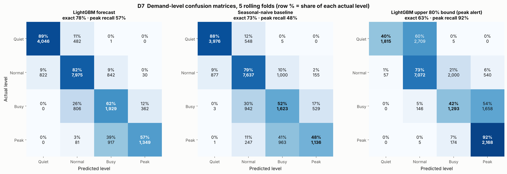

# D — Modeling & Evaluation (team teamdev)

Generated by `notebooks/04_modeling_and_evaluation.ipynb`. **Main split:** train 01 Jan – 17 Oct 2025 (79,190 zone-hours), validate 18 Oct – 31 Oct 2025 (3,914 zone-hours, mean 33.4 trips). **Rolling origin:** cuts 2025-08-23, 2025-09-06, 2025-09-20, 2025-10-04, 2025-10-18, each validating the next 14 days. Only observed zone-hours are trained on and scored. Fitted features are re-learned inside each fold from its training rows only. RMSE and MAE are in trips per zone-hour.

## D1 Baselines

| model                                                         |   rmse |   mae |
|:--------------------------------------------------------------|-------:|------:|
| mean predictor                                                |  27.53 | 20.69 |
| seasonal naive (zone x weekday x hour, whole training period) |  11.30 |  7.36 |
| seasonal naive (zone x weekday x hour, last 4 weeks)          |   9.94 |  6.64 |
| moving average (zone x hour, last 7 days)                     |  14.55 |  9.49 |

The mean predictor ignores zone and hour and is useless (RMSE 27.5). The seasonal-naive profile cuts the error by more than half, and using only the **last 4 weeks** is better again (9.94 vs 11.30) because demand grows through the year (B1.4) and the full-period average is stale. The 7-day **moving average** is recent but blind to the weekday (14.55): weekends look nothing like weekdays in the business zones, so averaging them together costs more than the freshness gains. The 4-week seasonal naive is the bar every model must beat.

## D2 Model comparison

Six model families on the same split. The machine-learning models all get the same 35 features (the D8 feature is added later). ARIMA is the classical time-series model: one per zone, fitted on that zone's last 8 weeks of hourly trips (log scale) as daily and weekly Fourier seasonality plus ARIMA(2,0,1) on the remainder, forecasting the whole 14 days ahead; it sees no weather or events. `rolling_rmse_mean` is the mean over the 5 rolling-origin folds (D3); `fit_seconds` is one fit plus prediction.

| model                                                                             |   rmse |   mae |   rolling_rmse_mean |   fit_seconds |   rmse_vs_seasonal_naive_pct |
|:----------------------------------------------------------------------------------|-------:|------:|--------------------:|--------------:|-----------------------------:|
| LightGBM (Poisson objective)                                                      |   8.07 |  5.58 |                8.77 |          4.04 |                       -18.84 |
| HistGradientBoosting (log target)                                                 |   8.20 |  5.65 |                8.99 |          1.94 |                       -17.53 |
| Gradient boosting, scikit-learn classic (log target)                              |   8.63 |  5.92 |                9.16 |         91.31 |                       -13.20 |
| Random forest (log target)                                                        |   8.79 |  5.97 |                9.60 |         28.82 |                       -11.63 |
| ARIMA(2,0,1) on daily/weekly Fourier seasonality, one per zone (time series only) |  10.41 |  6.86 |               11.52 |          4.97 |                         4.72 |
| Ridge (linear, log target, one-hot zone/hour/weekday)                             |  12.99 |  7.80 |               13.95 |          0.69 |                        30.61 |

**Winner: LightGBM (Poisson objective)** (RMSE 8.07, 19% better than the 4-week seasonal naive). The three gradient-boosting models (LightGBM 8.07, HistGradientBoosting 8.20, classic gradient boosting 8.63) lead, ahead of the random forest and the linear model: demand is driven by interactions (zone x hour x weekday, rain x zone type, event phase x zone) that trees find automatically and a linear model cannot. **ARIMA** (10.41; rolling 11.52 vs seasonal naive 11.48) does no better than the seasonal naive: over a 14-day horizon its short-memory ARIMA part fades to the smooth seasonal curve within hours, and it cannot see rain, events or holidays — the features that explain the departures from the usual weekly shape. We pick LightGBM because it is the most accurate, trains in seconds, handles missing lags natively and its Poisson objective matches count data.

## D3 Rolling-origin validation

| cut        | valid_to   |   n_train |   n_valid |   mean_trips |   lightgbm_rmse |   lightgbm_mae |   seasonal_naive_rmse |   improvement_pct |
|:-----------|:-----------|----------:|----------:|-------------:|----------------:|---------------:|----------------------:|------------------:|
| 2025-08-23 | 2025-09-05 |     63462 |      3937 |        31.41 |            8.24 |           5.69 |                 11.31 |             27.18 |
| 2025-09-06 | 2025-09-19 |     67399 |      3930 |        32.11 |            9.45 |           5.95 |                 12.05 |             21.59 |
| 2025-09-20 | 2025-10-03 |     71329 |      3926 |        33.87 |            9.99 |           6.08 |                 13.45 |             25.70 |
| 2025-10-04 | 2025-10-17 |     75255 |      3935 |        32.00 |            8.12 |           5.43 |                 10.65 |             23.81 |
| 2025-10-18 | 2025-10-31 |     79190 |      3914 |        33.45 |            8.07 |           5.58 |                  9.94 |             18.84 |

LightGBM: RMSE **8.77 ± 0.89** (mean ± sd over 5 folds); seasonal naive 11.48 ± 1.35. The model wins in every fold, and its spread is small relative to the gap, so the main-split result is not luck. The worst fold is 2025-09-20 – 2025-10-03 (RMSE 9.99): it contains Meskel eve (26 Sep, the Demera bonfire at Meskel Square next to Kazanchis) and the end of the rainy season, and the Ethiopian New Year eve falls in the fold before — unlisted holiday-eve crowds the features cannot see (D7).

## D4 Feature availability & leakage audit

| column                         | family      | known_at_forecast_time   | used   | why                                                                    |
|:-------------------------------|:------------|:-------------------------|:-------|:-----------------------------------------------------------------------|
| hour                           | calendar    | yes                      | yes    | known from the calendar / event schedule                               |
| dow                            | calendar    | yes                      | yes    | known from the calendar / event schedule                               |
| is_weekend                     | calendar    | yes                      | yes    | known from the calendar / event schedule                               |
| month                          | calendar    | yes                      | yes    | known from the calendar / event schedule                               |
| day_of_month                   | calendar    | yes                      | yes    | known from the calendar / event schedule                               |
| is_payday_window               | calendar    | yes                      | yes    | known from the calendar / event schedule                               |
| is_public_holiday              | calendar    | yes                      | yes    | known from the calendar / event schedule                               |
| is_school_break                | calendar    | yes                      | yes    | known from the calendar / event schedule                               |
| trend_days                     | calendar    | yes                      | yes    | known from the calendar / event schedule                               |
| zone_code                      | zone        | yes                      | yes    | known from the calendar / event schedule                               |
| zone_type_code                 | zone        | yes                      | yes    | known from the calendar / event schedule                               |
| temp_c                         | weather     | yes                      | yes    | weather forecast for the fortnight (data_type = forecast)              |
| rain_mm                        | weather     | yes                      | yes    | weather forecast for the fortnight (data_type = forecast)              |
| rain_3h                        | weather     | yes                      | yes    | weather forecast for the fortnight (data_type = forecast)              |
| rain_class                     | weather     | yes                      | yes    | weather forecast for the fortnight (data_type = forecast)              |
| humidity_pct                   | weather     | yes                      | yes    | weather forecast for the fortnight (data_type = forecast)              |
| wind_kmh                       | weather     | yes                      | yes    | weather forecast for the fortnight (data_type = forecast)              |
| ev_football_window             | events      | yes                      | yes    | known from the calendar / event schedule                               |
| ev_concert_window              | events      | yes                      | yes    | known from the calendar / event schedule                               |
| ev_conference_window           | events      | yes                      | yes    | known from the calendar / event schedule                               |
| ev_exhibition_window           | events      | yes                      | yes    | known from the calendar / event schedule                               |
| ev_road_closure                | events      | yes                      | yes    | known from the calendar / event schedule                               |
| ev_sports_run_window           | events      | yes                      | yes    | known from the calendar / event schedule                               |
| ev_pre                         | events      | yes                      | yes    | known from the calendar / event schedule                               |
| ev_during                      | events      | yes                      | yes    | known from the calendar / event schedule                               |
| ev_post                        | events      | yes                      | yes    | known from the calendar / event schedule                               |
| ev_log_attendance              | events      | yes                      | yes    | known from the calendar / event schedule                               |
| ev_hours_to_major_start        | events      | yes                      | yes    | known from the calendar / event schedule                               |
| ev_hours_since_major_end       | events      | yes                      | yes    | known from the calendar / event schedule                               |
| lag_14d                        | lag / trend | yes                      | yes    | >= 14 days old, so known on 31 Oct for every hour to 14 Nov            |
| lag_21d                        | lag / trend | yes                      | yes    | >= 14 days old, so known on 31 Oct for every hour to 14 Nov            |
| lag_28d                        | lag / trend | yes                      | yes    | >= 14 days old, so known on 31 Oct for every hour to 14 Nov            |
| lag_mean_2to4w                 | lag / trend | yes                      | yes    | >= 14 days old, so known on 31 Oct for every hour to 14 Nov            |
| profile_zone_dow_hour          | lag / trend | yes                      | yes    | >= 14 days old, so known on 31 Oct for every hour to 14 Nov            |
| zone_level_2to4w               | lag / trend | yes                      | yes    | >= 14 days old, so known on 31 Oct for every hour to 14 Nov            |
| is_holiday_eve                 | calendar    | yes                      | yes    | known from the calendar / event schedule                               |
| active_drivers                 | excluded    | no                       | no     | only observed after the hour happens; drivers follow demand (r = 0.99) |
| avg_wait_min                   | excluded    | no                       | no     | consequence of demand vs supply in that hour                           |
| avg_fare_birr                  | excluded    | no                       | no     | only observed after the trips happen                                   |
| lag_1h / lag_24h (not built)   | excluded    | no                       | no     | the hour before is unknown for most of the 14-day horizon              |
| ev_cancelled_window            | excluded    | no                       | no     | cancelled events did not happen; kept for analysis only (B3.4)         |
| row_status / trips_spike_fixed | excluded    | no                       | no     | describe the training record, not the future hour                      |

| experiment                              | validation                             |   rmse |
|:----------------------------------------|:---------------------------------------|-------:|
| honest model (forecast-time features)   | chronological, 18-31 Oct               |   8.10 |
| + active_drivers + avg_wait_min (LEAKY) | chronological, 18-31 Oct               |   3.15 |
| honest model                            | random shuffled 5-fold (contrast only) |   7.23 |

Adding `active_drivers` and `avg_wait_min` drops the validation RMSE from 8.10 to **3.15** — it looks like a huge win, but it is leakage: those columns are measured during the hour we are trying to forecast (drivers follow demand at 1.3 trips each), so in production next Tuesday's driver count does not exist and the model would have nothing to read. Likewise a shuffled random split gives an optimistic 7.23 because neighbouring hours of the same days land on both sides; it is shown only as a contrast and never used for selection.

## D5 Ablation

Final model type (LightGBM, Poisson) on identical splits; 'calendar+zone+trend' includes the holiday/school-break calendar and the lag/trend features; '+events' adds the venue-event features; '+weather' adds the six weather features.

| feature set         |   n_features |   main_split_rmse |   main_split_mae |   rolling_rmse_mean |   rolling_mae_mean |   delta_rolling_rmse_vs_calendar |   delta_rolling_mae_vs_calendar |
|:--------------------|-------------:|------------------:|-----------------:|--------------------:|-------------------:|---------------------------------:|--------------------------------:|
| calendar+zone+trend |           17 |             8.775 |            5.892 |               9.934 |              6.325 |                            0.000 |                           0.000 |
| +weather            |           23 |             8.276 |            5.687 |               9.055 |              5.847 |                           -0.879 |                          -0.478 |
| +events             |           29 |             8.634 |            5.825 |               9.585 |              6.222 |                           -0.350 |                          -0.103 |
| +both               |           35 |             8.070 |            5.584 |               8.773 |              5.748 |                           -1.161 |                          -0.577 |

Both joins pay off. Weather lowers the rolling RMSE by **0.88** (8.9%) and events by **0.35** (3.5%); together 1.16 (11.7%). Weather likely helps more than events because rain touches many hours across all zones, while events touch only a few zones for a few hours each.

## D6 Hyperparameter tuning

Random search, 16 trials + the default, scored by mean RMSE over the 4 earlier rolling folds (2025-08-23, 2025-09-06, 2025-09-20, 2025-10-04) so the main validation fortnight stays untouched. Search space: `num_leaves` [15, 31, 63, 127]; `learning_rate` [0.02, 0.03, 0.05, 0.08]; `n_estimators` [400, 700, 1000, 1400]; `min_child_samples` [10, 20, 40, 80]; `colsample_bytree` [0.5, 0.7, 0.9]; `subsample` [0.6, 0.8, 1.0]; `reg_lambda` [0.0, 1.0, 5.0, 20.0].

All trials, best first:

|   trial |   num_leaves |   learning_rate |   n_estimators |   min_child_samples |   colsample_bytree |   subsample |   reg_lambda |   cv_rmse |
|--------:|-------------:|----------------:|---------------:|--------------------:|-------------------:|------------:|-------------:|----------:|
|       1 |           15 |           0.080 |           1000 |                  20 |              0.700 |       1.000 |        0.000 |     8.881 |
|       6 |           15 |           0.080 |           1400 |                  20 |              0.700 |       0.600 |       20.000 |     8.892 |
|      12 |           15 |           0.050 |           1000 |                  80 |              0.700 |       0.600 |       20.000 |     8.904 |
|      15 |           63 |           0.020 |           1400 |                  10 |              0.900 |       0.600 |       20.000 |     8.942 |
|       0 |           63 |           0.030 |            900 |                  20 |              0.800 |       0.800 |        1.000 |     8.949 |
|       4 |           31 |           0.020 |           1400 |                  80 |              0.700 |       0.800 |       20.000 |     8.955 |
|       9 |           63 |           0.020 |           1000 |                  40 |              0.900 |       1.000 |        1.000 |     8.984 |
|       5 |           63 |           0.030 |            700 |                  10 |              0.500 |       0.800 |       20.000 |     8.994 |
|      13 |           63 |           0.050 |            400 |                  20 |              0.900 |       1.000 |        1.000 |     9.001 |
|       8 |          127 |           0.080 |            400 |                  20 |              0.700 |       0.800 |        0.000 |     9.005 |
|      11 |          127 |           0.020 |            700 |                  10 |              0.900 |       0.800 |        1.000 |     9.007 |
|      10 |          127 |           0.030 |            700 |                  80 |              0.700 |       0.600 |        1.000 |     9.014 |
|       3 |           63 |           0.080 |           1000 |                  10 |              0.900 |       0.800 |        5.000 |     9.054 |
|       7 |           63 |           0.030 |            400 |                  80 |              0.700 |       1.000 |        5.000 |     9.114 |
|      14 |          127 |           0.080 |            700 |                  80 |              0.500 |       0.600 |        5.000 |     9.120 |
|      16 |          127 |           0.080 |           1000 |                  20 |              0.900 |       0.600 |       20.000 |     9.209 |
|       2 |           63 |           0.020 |            400 |                  40 |              0.900 |       1.000 |       20.000 |     9.235 |

Best parameters: `num_leaves`=15, `learning_rate`=0.08, `n_estimators`=1000, `min_child_samples`=20, `colsample_bytree`=0.7, `subsample`=1.0, `reg_lambda`=0.0.

| params             |   tuning_cv_rmse |   main_split_rmse |   main_split_mae |   rolling_rmse_mean |
|:-------------------|-----------------:|------------------:|-----------------:|--------------------:|
| default (trial 0)  |            8.949 |             8.070 |            5.584 |               8.773 |
| tuned (best trial) |            8.881 |             8.138 |            5.611 |               8.733 |

Tuning moves the main-split RMSE from 8.07 to 8.14 and the rolling mean from 8.77 to 8.73. The tuned settings win on the 4 folds they were chosen on and on the 5-fold average, but are slightly worse on the main fortnight alone: the difference is within fold-to-fold noise. We keep the tuned settings because they were selected without looking at the main fortnight (a smaller, faster model); the features matter far more than the knobs.

## D7 Error analysis

Out-of-fold predictions of the tuned model over all 5 rolling folds (19,642 zone-hours, 23 Aug – 31 Oct), so holidays are included.

**(a) By zone**

| zone      |   zone_hours |   mean_trips |   rmse |   mae |   bias(actual-pred) |   rmse_pct_of_mean |
|:----------|-------------:|-------------:|-------:|------:|--------------------:|-------------------:|
| Kazanchis |         1641 |        37.62 |  13.41 |  6.94 |                1.09 |              35.64 |
| Merkato   |         1634 |        45.93 |  11.30 |  7.35 |                0.88 |              24.59 |
| Bole      |         1638 |        44.77 |  10.64 |  7.75 |                0.71 |              23.76 |
| Megenagna |         1625 |        44.01 |  10.10 |  7.01 |                0.78 |              22.96 |
| Piassa    |         1642 |        32.59 |   8.71 |  5.62 |                0.75 |              26.71 |
| Lideta    |         1633 |        32.36 |   7.80 |  5.63 |                0.70 |              24.12 |
| CMC       |         1628 |        29.82 |   7.25 |  5.29 |                0.70 |              24.31 |
| Gerji     |         1631 |        28.26 |   6.89 |  4.99 |                0.89 |              24.37 |
| Kolfe     |         1643 |        26.40 |   6.81 |  4.90 |                0.33 |              25.79 |
| Sarbet    |         1644 |        25.02 |   6.48 |  4.75 |                0.40 |              25.89 |
| Arat Kilo |         1637 |        23.41 |   6.44 |  4.43 |                0.14 |              27.49 |
| Ayat      |         1646 |        20.78 |   5.76 |  4.17 |                0.69 |              27.72 |

**By hour of day**

|   hour |   zone_hours |   mean_trips |   rmse |   mae |   bias(actual-pred) |
|-------:|-------------:|-------------:|-------:|------:|--------------------:|
|      0 |          816 |         9.55 |   5.09 |  2.75 |                0.13 |
|      1 |          811 |         7.53 |   3.50 |  2.35 |               -0.03 |
|      2 |          818 |         6.38 |   3.05 |  2.19 |                0.03 |
|      3 |          818 |         6.64 |   2.72 |  2.12 |                0.22 |
|      4 |          817 |         9.17 |   3.61 |  2.57 |                0.19 |
|      5 |          808 |        17.21 |   5.17 |  3.65 |                0.31 |
|      6 |          824 |        32.72 |   8.34 |  6.21 |                0.95 |
|      7 |          819 |        49.31 |  11.23 |  8.28 |                2.28 |
|      8 |          822 |        49.72 |  10.40 |  7.81 |                1.25 |
|      9 |          822 |        40.00 |   8.71 |  6.52 |                1.24 |
|     10 |          821 |        33.69 |   7.45 |  5.59 |                0.47 |
|     11 |          815 |        34.75 |   8.12 |  5.96 |                0.39 |
|     12 |          819 |        39.96 |   8.98 |  6.68 |                0.88 |
|     13 |          815 |        42.95 |   9.68 |  6.92 |                1.01 |
|     14 |          818 |        41.23 |   9.53 |  6.74 |                1.11 |
|     15 |          820 |        38.73 |   9.47 |  6.75 |                0.82 |
|     16 |          815 |        43.84 |  10.22 |  7.33 |                0.19 |
|     17 |          812 |        55.61 |  14.84 |  9.19 |                0.49 |
|     18 |          827 |        61.81 |  14.87 |  9.72 |                1.13 |
|     19 |          823 |        53.70 |  11.20 |  8.27 |                0.54 |
|     20 |          823 |        43.31 |   9.56 |  6.98 |                1.18 |
|     21 |          818 |        29.95 |   8.39 |  5.63 |                0.66 |
|     22 |          819 |        20.46 |   6.08 |  4.18 |                0.76 |
|     23 |          822 |        12.59 |   4.59 |  3.12 |               -0.10 |

**By day type**

| day_type   |   zone_hours |   mean_trips |   rmse |   mae |   bias(actual-pred) |
|:-----------|-------------:|-------------:|-------:|------:|--------------------:|
| holiday    |          835 |        28.19 |  10.22 |  7.14 |                1.72 |
| weekday    |        13486 |        34.17 |   9.16 |  5.90 |                0.80 |
| weekend    |         5321 |        29.20 |   7.37 |  5.10 |                0.17 |

**(b) The 10 largest errors**

| zone      | pickup_hour         |   trips |   pred |   err |   rain_3h | ev_ids            | hypothesis                                                                                       |
|:----------|:--------------------|--------:|-------:|------:|----------:|:------------------|:-------------------------------------------------------------------------------------------------|
| Kazanchis | 2025-09-26 18:00:00 |   321.0 |  128.8 | 192.2 |       8.4 | nan               | eve of Meskel (Finding of the True Cross): unlisted eve crowds (Demera bonfire at Meskel Square) |
| Kazanchis | 2025-09-26 17:00:00 |   311.0 |  127.4 | 183.6 |       3.5 | nan               | eve of Meskel (Finding of the True Cross): unlisted eve crowds (Demera bonfire at Meskel Square) |
| Kazanchis | 2025-09-10 17:00:00 |   266.0 |  128.3 | 137.7 |       0.6 | EVT-0119;EVT-0120 | eve of Enkutatash (Ethiopian New Year): unlisted eve crowds                                      |
| Kazanchis | 2025-09-10 18:00:00 |   230.0 |  115.7 | 114.3 |       0.0 | EVT-0119;EVT-0120 | eve of Enkutatash (Ethiopian New Year): unlisted eve crowds                                      |
| Kazanchis | 2025-09-10 21:00:00 |   154.0 |   54.0 | 100.0 |       1.8 | EVT-0119;EVT-0120 | eve of Enkutatash (Ethiopian New Year): unlisted eve crowds                                      |
| Kazanchis | 2025-10-14 17:00:00 |   188.0 |   91.7 |  96.3 |       0.0 | nan               | no listed event or rain: likely an unlisted event                                                |
| Piassa    | 2025-09-26 17:00:00 |   198.0 |  109.9 |  88.1 |       3.5 | nan               | eve of Meskel (Finding of the True Cross): unlisted eve crowds (Demera bonfire at Meskel Square) |
| Merkato   | 2025-09-10 13:00:00 |   183.0 |   96.7 |  86.3 |       0.0 | nan               | eve of Enkutatash (Ethiopian New Year): unlisted eve crowds                                      |
| Merkato   | 2025-09-10 15:00:00 |   167.0 |   80.8 |  86.2 |       0.6 | nan               | eve of Enkutatash (Ethiopian New Year): unlisted eve crowds                                      |
| Kazanchis | 2025-09-10 19:00:00 |   147.0 |   78.1 |  68.9 |       0.0 | EVT-0119;EVT-0120 | eve of Enkutatash (Ethiopian New Year): unlisted eve crowds                                      |

Errors scale with volume: Kazanchis, Merkato and Bole have the largest RMSE but similar errors relative to their demand, and the evening peak hours carry the most error. Holidays are harder than ordinary days. **9 of the 10 biggest misses are on the eve of a public holiday** — Meskel eve (the Demera bonfire at Meskel Square, next to Kazanchis and Piassa) and Ethiopian New Year eve (Merkato shopping) — which the calendar does not list. The remaining one has no listed event or rain, so it is probably an unlisted gathering. All 10 are under-forecasts (positive errors): the model plays safe on surges.

### D7 (continued) Demand-level confusion matrix

Trips are a count, so we turn them into four demand levels to read the model like a classifier. For every fold, each zone's thresholds are the 25th, 75th and 90th percentiles of its trips over the last 8 weeks of that fold's training data: **Quiet** (below the 25th), **Normal**, **Busy** (75th–90th) and **Peak** (above the 90th). The same thresholds are applied to the actual count and to each forecast, over the same 19,642 out-of-fold zone-hours as above.

**LightGBM (tuned): rows = actual level, columns = predicted level (row %)**

| actual   | pred Quiet   | pred Normal   | pred Busy   | pred Peak   |   total |
|:---------|:-------------|:--------------|:------------|:------------|--------:|
| Quiet    | 4,046 (89%)  | 482 (11%)     | 1 (0%)      | 0 (0%)      |   4,529 |
| Normal   | 822 (9%)     | 7,975 (82%)   | 842 (9%)    | 30 (0%)     |   9,669 |
| Busy     | 0 (0%)       | 806 (26%)     | 1,929 (62%) | 362 (12%)   |   3,097 |
| Peak     | 0 (0%)       | 81 (3%)       | 917 (39%)   | 1,349 (57%) |   2,347 |

**Seasonal-naive baseline (same thresholds)**

| actual   | pred Quiet   | pred Normal   | pred Busy   | pred Peak   |   total |
|:---------|:-------------|:--------------|:------------|:------------|--------:|
| Quiet    | 3,976 (88%)  | 548 (12%)     | 5 (0%)      | 0 (0%)      |   4,529 |
| Normal   | 877 (9%)     | 7,637 (79%)   | 1,000 (10%) | 155 (2%)    |   9,669 |
| Busy     | 3 (0%)       | 942 (30%)     | 1,623 (52%) | 529 (17%)   |   3,097 |
| Peak     | 1 (0%)       | 247 (11%)     | 963 (41%)   | 1,136 (48%) |   2,347 |

**Summary**

| forecast                  |   exact_level_accuracy |   within_one_level |   macro_f1 |   peak_recall |   peak_precision |   peaks_called_quiet_or_normal |   under_called_share |   over_called_share |
|:--------------------------|-----------------------:|-------------------:|-----------:|--------------:|-----------------:|-------------------------------:|---------------------:|--------------------:|
| LightGBM (tuned)          |                  0.779 |              0.994 |      0.732 |         0.575 |            0.775 |                         81.000 |                0.134 |               0.087 |
| Seasonal naive (4 weeks)  |                  0.732 |              0.979 |      0.670 |         0.484 |            0.624 |                        248.000 |                0.154 |               0.114 |
| LightGBM, upper 80% bound |                  0.629 |              0.972 |      0.582 |         0.924 |            0.497 |                          5.000 |                0.019 |               0.352 |

The model puts 78% of zone-hours in the right level (baseline 73%) and 99.4% within one level, with a macro-F1 of 0.73 against 0.67. Its weak spot is the top of the range: it catches only 57% of actual peak hours, and most of the misses are called Busy rather than Quiet or Normal (81 peaks were called Quiet or Normal). That matches D7: the model under-forecasts surges. For planning, using the **upper bound of the 80% interval** as a peak alert raises peak recall to 92%, at the cost of precision (50% of alerts are real peaks), which is the right trade when a missed peak means riders without cars. (The interval width is calibrated on the last two folds, so the alert row is slightly optimistic for those folds.)

## D8 Response to findings

Change: D7 showed the largest misses on holiday eves, so we added `is_holiday_eve` (1 on the day before any confirmed public holiday, all zones; the tree learns which zones react). We also tried a count of simultaneous events, which did not help and was dropped.

| model                          |   rolling_rmse_mean |   rolling_mae_mean |   rmse_on_holiday_eves |   main_split_rmse |
|:-------------------------------|--------------------:|-------------------:|-----------------------:|------------------:|
| tuned, before D8               |               8.733 |              5.735 |                 16.894 |             8.138 |
| tuned + is_holiday_eve (final) |               8.680 |              5.728 |                 16.111 |             8.091 |

| cut        |   before |   after |
|:-----------|---------:|--------:|
| 2025-08-23 |    8.185 |   8.185 |
| 2025-09-06 |    9.411 |   9.237 |
| 2025-09-20 |    9.873 |   9.813 |
| 2025-10-04 |    8.057 |   8.075 |
| 2025-10-18 |    8.138 |   8.091 |

It helped where it should: RMSE on holiday-eve hours fell from 16.9 to 16.1, and the rolling RMSE moved by -0.053 overall. The main-split fortnight (18–31 Oct) has no holiday eve, so its score moves only by noise (8.138 -> 8.091). We keep the feature: it costs nothing and protects the eves of future holidays. The two-events-at-once misses remain (too few examples to learn from).

## D9 Plain-language metric

| metric   |   trips per zone-hour |   % of mean demand |   drivers (÷ 1.3) |
|:---------|----------------------:|-------------------:|------------------:|
| RMSE     |                   8.1 |               24.2 |               6.2 |
| MAE      |                   5.6 |               16.7 |               4.3 |

**For an operations manager:** in a typical zone and hour (about 33 trip requests), our forecast is off by about **5.6 trips** on average (MAE, 17% of demand); bigger misses pull the root-mean-square error up to 8.1 trips (24%). With drivers completing about 1.3 trips per hour (history median 1.31), that is roughly **4 drivers too many or too few per zone per hour** on a normal hour, and around 6 when the occasional big misses (holiday eves, surges) are weighted in (RMSE). The seasonal-naive rule of thumb would be off by 6.6 trips (5 drivers).

## Final model

LightGBM (Poisson), tuned parameters, 36 features, refit on all 83,104 observed zone-hours of 1 Jan – 31 Oct and saved to `models/final_model.joblib` (with its feature list, parameters and validation scores). **Validation score: RMSE 8.09, MAE 5.60 on 18–31 Oct; rolling-origin RMSE 8.68 ± 0.80** (seasonal naive: 9.94 on 18–31 Oct, 11.48 rolling). Uses weather (6) and event (12 + holiday flags) features (Rule 5), only forecast-time features (Rule 6), chronological validation only (Rule 7) and nothing fitted on test (Rule 8).

## Figures

Validation RMSE on 18-31 Oct for the baselines (mean, seasonal naive, moving average), six model families (ARIMA, ridge, random forest and three gradient-boosting variants) and the tuned/final LightGBM (bars, from zero), with the rolling-origin mean ± sd over 5 folds (diamonds). The final model (8.09) beats the best baseline (9.94) by 19% and does so in every fold. So what: boosted trees on well-joined features are the right tool here; tuning adds little.

Hourly forecasts (model trained up to 17 Oct) against actual trips for three contrasting zones over the full validation fortnight. The model follows the daily and weekly shape in each zone, including Kazanchis' empty weekends and Bole's weekend nights; the misses are the tallest surge peaks, which it under-shoots. So what: plan for the forecast, keep a buffer at known peaks (see the stretch intervals).

Permutation importance: how much the validation RMSE rises when each feature is shuffled; weather features in blue, event features in orange. The zone x weekday x hour profile dominates (its bar is cut off; it already encodes zone and hour, so those rank lower on their own), but the top weather feature ranks #3 and the top event feature #9. So what: the joins add real, if smaller, signal on top of the calendar.
